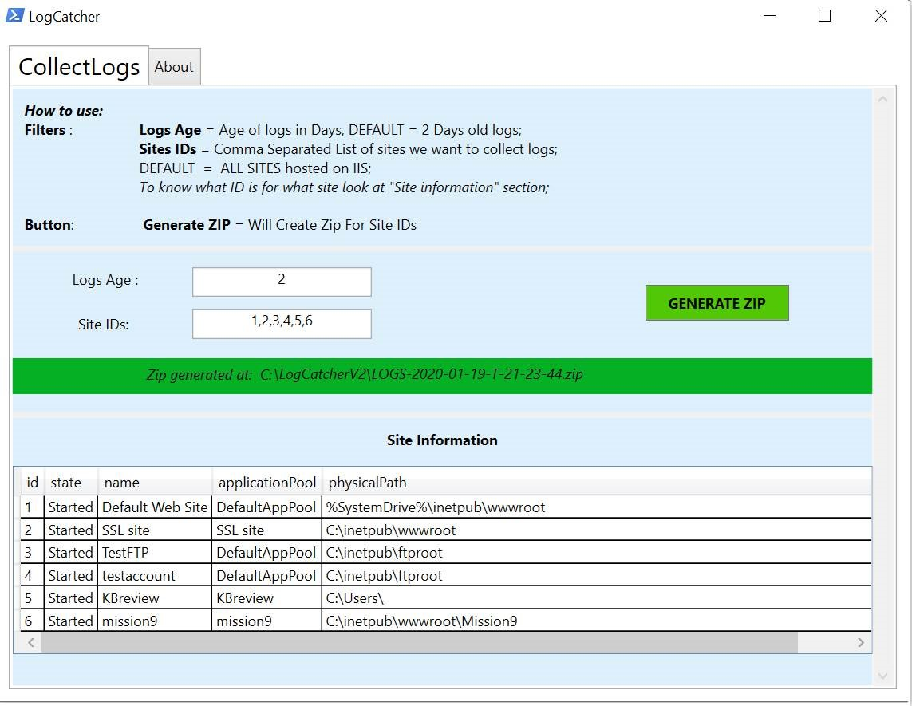

[LogCatcher]: [https://github.com/NL-Cristi/LogCatcher]

I'm a **LAZY** person so:

Back when i was in MS Customer Support it was kind of anoying to have the customers collect all IIS related logs from all the places.

For this i wrote 📺 [LogCatcher][LogCatcher] a PowerShell tool that would collect all logs related to IIS/.net.

If you want to have an easy life just go to the [Github][LogCatcher] and follow the instructions: 

